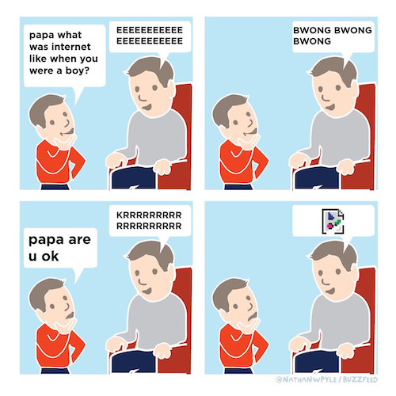

# Speech Playground

## What is this?
A small python program that ties together macOS' `say` utility and `ffmpeg` to generate a single audio file containing the audio results of the `say` commands.
 
## Inspiration
[@nathanwpyle/buzzfeed](https://twitter.com/nathanwpyle/status/1112336880199180288)

## Usage
1. Edit the `say` voices and text in `run.py`
2. `python3 run.py`

## Example output
[output.mp3](output.mp3)

